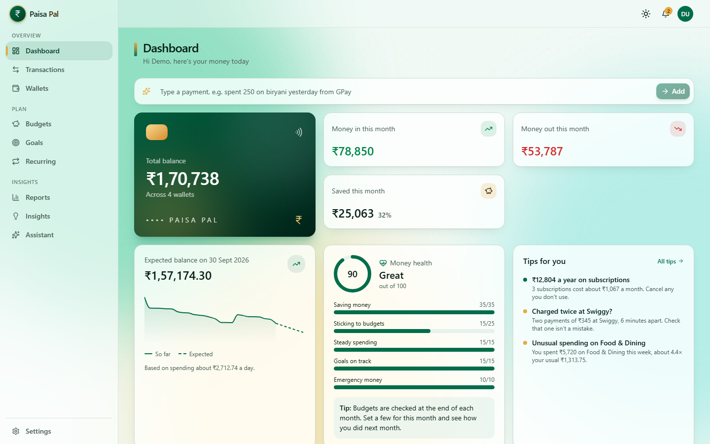
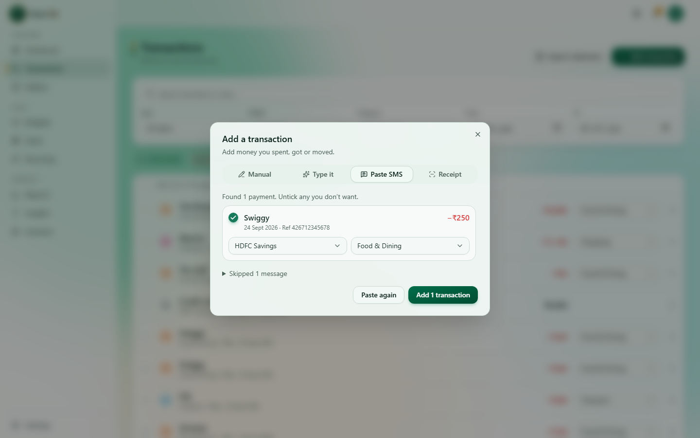
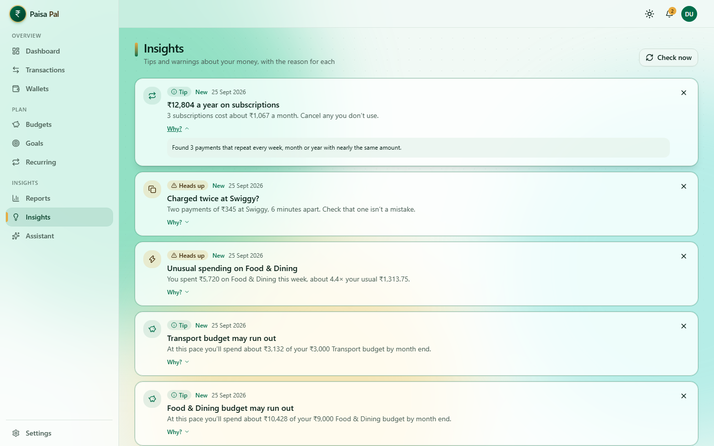
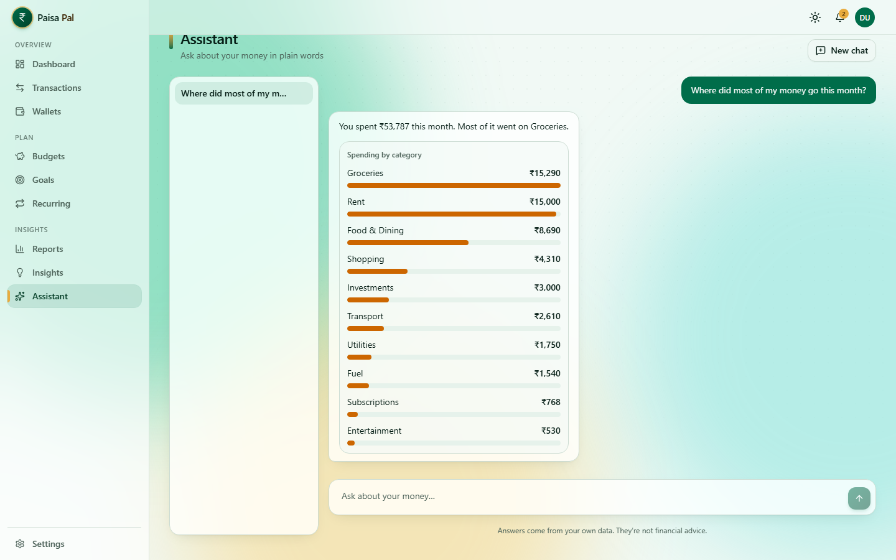
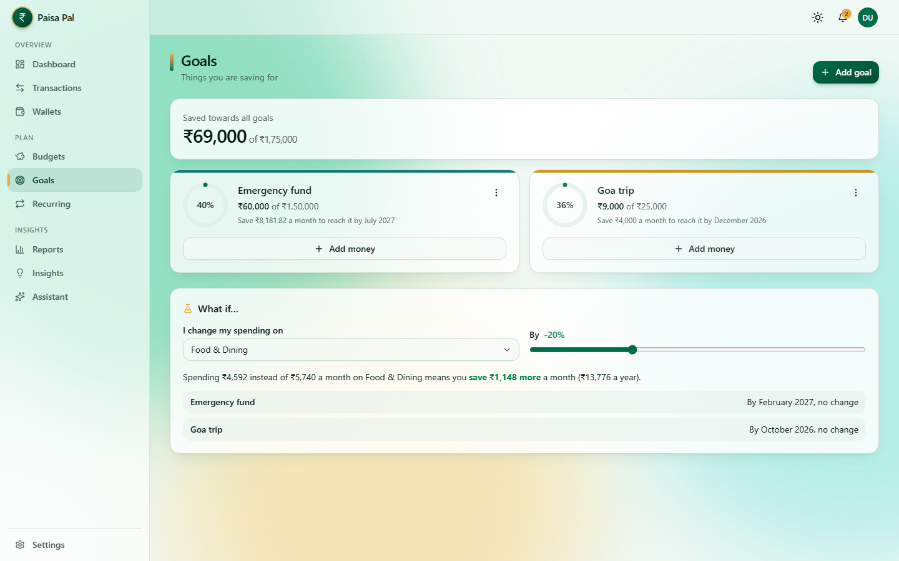
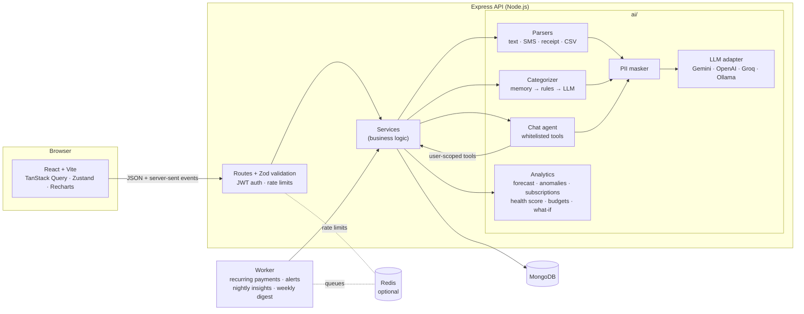

# Paisa Pal

[](https://github.com/krishnnavarun/paisa-pal/actions/workflows/server.yml)
[](https://github.com/krishnnavarun/paisa-pal/actions/workflows/client.yml)
[](https://github.com/krishnnavarun/paisa-pal/actions/workflows/e2e.yml)

**An AI-powered personal finance tracker for India.** AI does the logging, the sorting and the forecasting; you just make the decisions.

MERN stack (MongoDB, Express, React, Node.js) in plain JavaScript, with the Gemini API behind a provider adapter (OpenAI, Groq or a local Ollama model also work). Built for ₹, UPI and Indian bank SMS.



## What it does

| | |
|---|---|
| **Add payments in seconds** | Type *"spent 250 on biryani yesterday from GPay"*, paste bank SMS (one or fifty), snap a receipt, or import a bank statement CSV. Everything becomes a draft you check before saving. |
| **Sorted for you** | Categories come from your own past choices first, then keyword rules, then AI. Every correction teaches it. |
| **See month end coming** | A forecast of your balance on the last day of the month, with a warning when money may run low. |
| **Warnings that explain themselves** | Unusual weeks, double charges, budget alerts and subscriptions, each with a **Why?** showing the numbers used. |
| **Budgets, goals, what-if** | Budgets suggested from your last three months, savings goals with a monthly target, and a slider: *"spend 20% less on food"* → goals reached sooner. |
| **Ask in plain words** | A chat assistant that answers from your own data, with charts. It can only read, never change anything. |
| **Private by design** | Card numbers, phones, emails, UPI IDs, PAN, Aadhaar and OTPs are masked before any AI call. AI can be switched off, and everything else keeps working. |

**Try it without signing up:** the landing page's *Try the demo* button opens your own copy of an account with six months of realistic data (deleted after a day).

<table>
  <tr>
    <td></td>
    <td></td>
  </tr>
  <tr>
    <td></td>
    <td></td>
  </tr>
</table>

## How it's built



### How the AI works

- **The AI never touches the database.** The assistant can only call a fixed list of read-only tools (spending, income, budgets, goals, forecast…). Each tool adds the logged-in user's id on the server, so the model can't even ask for someone else's data.
- **AI for words, code for numbers.** Forecasts, anomaly scores, subscription detection, the health score and budget suggestions are plain, unit-tested JavaScript. The AI reads messy text and phrases answers; it never does the maths.
- **Cheapest step first.** SMS are read with patterns and receipts with on-device OCR when AI is off. Categories come from your own history, then keyword rules, and only the rest goes to the AI, in batches of 50.
- **Checked, not trusted.** Every AI answer must match a Zod schema. A bad answer is sent back once with the problems listed; then the app falls back to the non-AI way.
- **Private.** Personal details are masked before sending, text from SMS/receipts/CSV is fenced as data (not instructions), and logs record token counts, never content.

### Money and data rules

- Money is stored as whole **paise** (₹250.50 → `25050`) and only formatted in the UI (Indian grouping: ₹1,00,000).
- Every change to a transaction updates wallet balances in the **same MongoDB transaction**. A test checks after each scenario that every balance equals its opening balance plus its transactions.
- Every query is scoped to the logged-in user. `server/tests/api/isolation.test.js` proves one user can never read or change another's data.
- Budget months can start on any day (salary day) and follow the user's time zone.

## Project structure

```
paisa-pal/
├── client/        React + Vite (JSX) web app, with its own package.json and configs
│   └── e2e/       Playwright browser tests
├── server/        Express API + worker (JavaScript), with its own package.json and configs
├── docs/          screenshots
└── .github/       CI: server, client and end-to-end workflows
```

`client/` and `server/` are fully independent: install and run each one inside its own folder.

## Getting started

Requires Node.js 22.13+.

### 1. API (`server/`)

```bash
cd server
npm install
cp .env.example .env
```

Set `MONGODB_URI` in `server/.env`, either:

- **MongoDB Atlas (free, no install):** create an M0 cluster at [mongodb.com/atlas](https://www.mongodb.com/atlas), then paste its `mongodb+srv://...` connection string, or
- **Docker:** run `npm run db:up` (local MongoDB replica set + Redis) and keep the default URI.

Set `JWT_ACCESS_SECRET` and `JWT_REFRESH_SECRET` to two **different** random strings. Generate each with:

```bash
node -e "console.log(require('crypto').randomBytes(48).toString('hex'))"
```

Optional:

- **AI:** `GEMINI_API_KEY` from [Google AI Studio](https://aistudio.google.com/apikey) (free tier). Without it the app works as a normal tracker and AI buttons explain that AI isn't set up.
- **Receipts:** saved in `server/uploads/` by default. When deployed, set `RECEIPT_STORAGE=cloudinary` and your free Cloudinary keys. Photos are stored as private images that only their owner can view.
- **Redis:** `REDIS_URL` (e.g. a free [Upstash](https://upstash.com) `rediss://` URL) gives shared rate limits and BullMQ job queues. Without it, jobs run on timers.
- **Weekly email:** `RESEND_API_KEY` + `EMAIL_FROM` ([Resend](https://resend.com), free plan). Without them the weekly summary is shown in the app only.

```bash
npm run dev        # API on http://localhost:5000/api — reference at /api/docs
npm run worker     # background jobs (or set JOBS_IN_API=true to run them inside the API)
```

### 2. Web app (`client/`)

```bash
cd client
npm install
npm run dev        # http://localhost:5173 (forwards /api to the API)
```

Built with React 19, Vite, Tailwind CSS v4, shadcn/ui (Radix), Motion, React Router, TanStack Query, React Hook Form + Zod, Zustand and Recharts. Light and dark themes, works on phones, respects "reduce motion". Keyboard: **N** adds a transaction, **/** searches.

## How login works

- The **access token** (15-minute JWT) is kept in memory only, never in `localStorage`.
- The **refresh token** lives in an `httpOnly` cookie limited to `/api/auth`. It is rotated on every use and stored only as an HMAC hash. Reusing an old one (a sign of theft) ends every session from that login.
- Passwords are hashed with bcrypt (cost 12). Login is limited to 5 attempts a minute per IP, AI to 20 requests a minute per user, and the assistant to 30 questions an hour.

## Testing

| | |
|---|---|
| `server/`: `npm test` | ~625 unit and API tests (Vitest + Supertest on an in-memory MongoDB replica set). AI is replaced by a scripted fake provider. |
| `client/`: `npm test` | ~220 component and page tests (Vitest + Testing Library, API faked with MSW). |
| `client/`: `npm run e2e` | Playwright: sign up → set up → add a payment by typing → dashboard updates → ask the assistant; plus the demo. Starts its own API on an in-memory database with a pretend AI (first time: `npx playwright install chromium`). |
| `client/`: `npm run screenshots` | Re-takes the pictures in `docs/screenshots`. |
| both: `npm run check` | Lint + format check + tests. Run before a push. |

## Deploying

Free tiers are enough: **MongoDB Atlas** (database), **Render** (API), **Vercel** (web app), optionally **Upstash** (Redis) and **Cloudinary** (receipts).

1. **Atlas:** create an M0 cluster and a database user. Allow access from anywhere (`0.0.0.0/0`), because Render has no fixed IP on the free plan. Copy the `mongodb+srv://…` string.
2. **Render → New → Web Service** from this repo:
   - Root directory `server`, build `npm ci`, start `npm start`, health check path `/api/health`
   - Environment: `NODE_ENV=production`, `MONGODB_URI`, `JWT_ACCESS_SECRET`, `JWT_REFRESH_SECRET`, `CLIENT_URL=https://<your-app>.vercel.app`, `TRUST_PROXY_HOPS=2`, `JOBS_IN_API=true` (the free plan has no background workers), `GEMINI_API_KEY`, `RECEIPT_STORAGE=cloudinary` + the three `CLOUDINARY_*` keys
   - Name the service `paisa-pal-api` (or change the URL in `client/vercel.json` to match yours)
3. **Vercel → New Project** from this repo: root directory `client`, framework Vite. Leave `VITE_API_URL` unset (it defaults to `/api`).

`client/vercel.json` forwards `/api/*` from the Vercel domain to Render. The browser then sees one site, so the login cookie is a normal first-party cookie (Safari and newer Chrome block cross-site cookies, which would log people out on every reload). Because of the extra Vercel hop, the API trusts two proxies (`TRUST_PROXY_HOPS=2`) so rate limits see the real visitor IP.

## Roadmap

Voice entry, Hindi and Tamil input, a mobile app, bank sync through India's Account Aggregator framework, shared family wallets, split expenses, and net-worth tracking. See section 13 of [`CLAUDE.md`](./CLAUDE.md).
